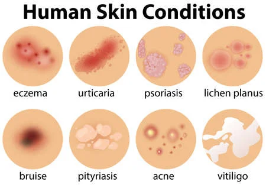

<div align ='center'>
  
# Unscript 2k22 - UNS_22_Pokemon
  
  </div>
Domain : Machine Learning / AI

### Problem Statement 
Build Mathematical model using ML and signal processing concept to process the skin issues into dryness and oiliness.

### Problem Description
Patients face a lot of problems with their skin. The main issue remains with the type of skin they have. Depending on the type of skin various skin diseases can occur. So if the skin is too dry it may start to peel and lead to various skin diseases like Psoriasis, Eczema etc. likewise too oily skin can lead to pimples which in turn can lead to scars. So the identification of skin type is of utmost need.

## Classes of Skin Diseases



## Tech Stack

+ Html


## Running Instructions
Open the terminal and type the following 
```
$ git clone https://github.com/mudit14224/3d-image-classification
$ cd 3d-image-classification
$ python3 -m venv 3d-class-env
$ source 3d-class-env/bin/activate
$ pip3 install -r requirements.txt
$ python3 run.py
```

## Developers

<table>
<tr align="center">


<td>

Mudit Jindal 

<p align="center">

</p>
<p align="center">
<a href = "https://github.com/mudit14224" target="_blank"></a>
<a href = "https://www.linkedin.com/in/mudit-jindal-40521a18b/" target="_blank">

</a>
</p>
</td>


<td>

Mahima Khatri

<p align="center">

</p>
<p align="center">
<a href = "https://github.com/MahimaKhatri" target="_blank"></a>
<a href = "https://www.linkedin.com/in/mahima-khatri-434a3b193/" target="_blank">

</a>
</p>
</td>
  
  <td>

Charvy Gugalia

<p align="center">

</p>
<p align="center">
<a href = "https://github.com/winee165" target="_blank"></a>
<a href = "https://www.linkedin.com/in/charvygugalia/" target="_blank">

</a>
</p>
</td>
</tr>
</table>

